# SkyHigh Portfolio Project 06 — Job Application Assistant

# Job Application Assistant & Tracker

An automated job search pipeline that fetches listings, tailors resume bullets, and tracks applications locally—with strict human review before submission.

Built as SkyHigh Academy Portfolio Project 06.

---

## Setup & run

Requires Python 3.11+ and an Anthropic API key (only for the tailoring step).

```bash
git clone git@github.com:freddie-c/Skyhigh-Portfolio-Project-06-Job-Assistant-Tracker.git
cd Skyhigh-Portfolio-Project-06-Job-Assistant-Tracker

python3 -m venv .venv
source .venv/bin/activate          # Windows: .venv\Scripts\activate
pip install -r requirements.txt

cp .env.example .env               # then add your key: ANTHROPIC_API_KEY=sk-ant-...
cp profile/base_resume.example.md profile/base_resume.md   # then replace with your own
```

Both `.env` and `profile/base_resume.md` are git-ignored. The example files show the
shape; the real ones never leave your machine.

Then:

```bash
python -m scripts.ingest           # fetch listings into data/tracker.db
streamlit run app.py               # open http://localhost:8501
```

Re-run `scripts.ingest` any time. It refreshes listing content but never overwrites a
status you've set.

Without an API key, everything works except packet generation.

---

## Generic plumbing vs. role-specific logic

The split is the point of the project: swap the right column, keep the left.

| Generic plumbing (code — don't edit to retarget) | Role-specific (data — edit freely) |
|---|---|
| `src/fetchers/greenhouse.py`, `lever.py` — one API each | `sources.yaml` — which boards, which title filters |
| `src/normalize.py` — maps any source shape to `Listing` | `research/ROLE-RESEARCH.md` — target role and keywords |
| `src/dedupe.py` — identity and merge logic | `prompts/tailor.md` — the tailoring instructions |
| `src/aggregate.py` — orchestration and error handling | `profile/base_resume.md` — your experience |
| `src/store.py` — schema, upserts, status transitions | |
| `src/packet.py` — packet rendering | |
| `app.py` — the local view | |

Adding a new source type is the one case that touches both: a new module in
`src/fetchers/`, a `from_<source>` function in `normalize.py`, and one entry in the
`FETCHERS` dict. Nothing else changes.

---

## Adapting this for a different role

Four files, no Python.

1. **`research/ROLE-RESEARCH.md`** — redo the research for your target role. Pull
   8–12 keywords from at least three real postings and note how many of the three
   mention each. Frequency is what lets the tailoring engine rank.

2. **`sources.yaml`** — replace the boards and the title filters:

```yaml
   sources:
     - name: example-co
       type: greenhouse
       board_token: exampleco      # from job-boards.greenhouse.io/<token>
     - name: other-co
       type: lever
       company: otherco            # from jobs.lever.co/<company>

   filters:
     include: [data, analytics, engineer]
     exclude: [senior, staff, principal, director, manager]
```

   Find board tokens with `site:job-boards.greenhouse.io "your role"` or
   `site:jobs.lever.co "your role"` in a search engine. The slug is in the URL.

3. **`profile/base_resume.md`** — your resume in Markdown. Specific beats broad:
   "Built a VPC with public and private subnets across two AZs in Terraform" gives
   the engine something real to rephrase. "Familiar with AWS" gives it nothing.

4. **`prompts/tailor.md`** — usually unchanged, but the hard rules are worth reading.
   Several exist because the model overstated experience during development.

Then `python -m scripts.ingest` and `streamlit run app.py`.

---

## Architecture

```mermaid
flowchart TD
    Config[sources.yaml<br/>boards + title filters]

    GH[greenhouse.py]
    LV[lever.py]
    GHAPI([Greenhouse public API])
    LVAPI([Lever public API])

    Norm[normalize.py<br/>map to common Listing schema]
    Filt[aggregate.py<br/>title include/exclude]
    Dedup[dedupe.py<br/>company + title + location key]
    DB[(data/tracker.db<br/>SQLite)]

    Resume[profile/base_resume.md]
    Prompt[prompts/tailor.md]
    Tailor[tailor.py<br/>Anthropic API]
    Packet[packet.py<br/>render Markdown]
    MD[packets/*.md<br/>DRAFT]

    App[app.py<br/>Streamlit on localhost]
    Human((Human reviews<br/>and submits))

    Config --> GH & LV
    GHAPI --> GH
    LVAPI --> LV
    GH & LV --> Norm --> Filt --> Dedup --> DB
    DB --> App
    App -->|one explicit click| Tailor
    Resume --> Tailor
    Prompt --> Tailor
    Tailor --> Packet --> MD --> App
    App --> Human
    Human -.->|status update| DB

    style Human fill:#2d4a2d,stroke:#5a9,stroke-width:3px
    style MD fill:#4a3d2d,stroke:#a85
```



Nothing in the diagram connects back out to an employer's systems. The last
automated step writes a Markdown file to disk.

**Design notes:** sources are config-driven, so adding a board is one YAML entry.
Each fetcher is wrapped individually — one dead source logs a warning and the run
continues. Status and packet state are deliberately excluded from the upsert, so
re-ingesting never resets your pipeline. The dedup key doubles as the primary key,
so uniqueness is enforced once rather than in two places that could drift.

Everything runs locally. SQLite is a single file, Streamlit binds to localhost, no
hosted database and no always-on compute. The only cost is the tailoring API call,
metered one explicit click at a time.

---

## Where automation stops, and why

This tool prepares; a person submits.

Every major job platform prohibits automated applications, and bot-submitted applications are easily spotted. But the strongest argument for keeping a human in the loop emerged during early testing:
On the very first generated draft, the model described "a live EKS-style cluster environment using kind"—implying managed-Kubernetes experience I don't have—while listing EKS as a missing gap three sections lower.
Because the text was fluent, confident, and specific, automated checks missed it entirely. A human review caught it in seconds.
The tailoring engine is built to match a job listing's vocabulary, but that same capability can lead it to stretch beyond the truth if left unchecked. To maintain complete accuracy and accountability:
Draft-Only Output: Every generated application package is explicitly marked DRAFT.
Auditability: Every tailored bullet links directly back to its source on your base resume.
Hard Stop on Disk: The pipeline ends at a local file.
The final decision of whether a claim is accurate and defensible in an interview belongs entirely to you—not the machine.

---

## Known limitations

- **Title filtering leaks.** Substring matching on titles keeps missing variants
  ("Sr." with a period, "Distinguished Engineer"). Every exclusion reveals the next
  one. The real fix is matching on the description — years of experience, required
  tools — rather than the title.
- **The database accumulates.** Closed postings are never removed. Correct for a
  tracker (a job you applied to should persist after the posting comes down) but
  it means stale rows build up. A `last_seen` timestamp would surface them.
- **Greenhouse intermittently times out** at the 10-second read timeout. Handled
  per-source, so other boards still return, but a run can silently miss a company.
- **Schema changes need a rebuild.** `CREATE TABLE IF NOT EXISTS` won't add a column
  to an existing table. Delete `data/tracker.db` and re-ingest.
- **Sources are limited by design.** Greenhouse and Lever public APIs only. One
  careers page was evaluated and dropped — its CDN returns 403 to automated clients
  even with a browser User-Agent, which is an explicit opt-out, not an obstacle.

---

## Security notes

- `.env` and `profile/base_resume.md` are git-ignored; `.env.example` and
  `base_resume.example.md` are committed to show the shape. Verify ignore rules with
  `git check-ignore -v`, not by their absence from `git status`.
- `packets/` and `data/` are ignored — generated drafts contain resume content.
- Job descriptions are untrusted third-party text. HTML is stripped at normalization,
  rules live in the system prompt rather than mixed with listing content, the listing
  is delimiter-wrapped and labeled as data, output must parse as JSON, and the model
  reports anything suspicious in a `flags` field.
- All SQL is parameterized. Status values are validated against an allowlist before
  reaching the database.
- Listing text renders with `st.text`, not `st.markdown`, so third-party content
  can't inject formatting or links into the local view.